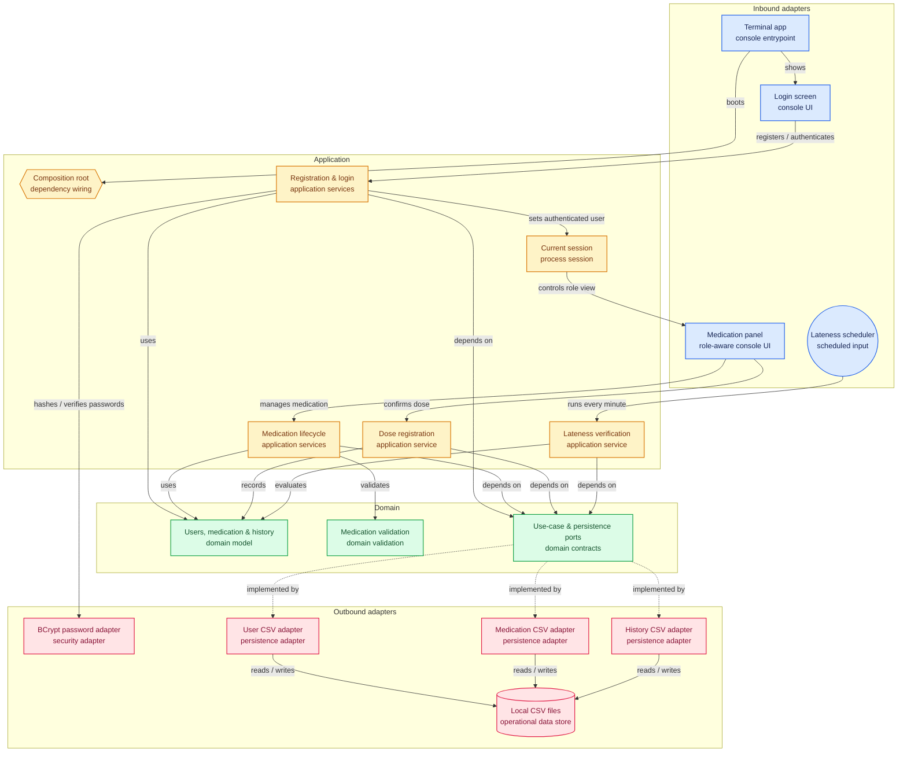

# Sistema de Acompanhamento de Medicamentos (CuidaMed)

Aplicação de terminal pensada para ajudar idosos e seus familiares a não esquecerem de tomar os medicamentos na hora certa.

A ideia por trás é simples: cada idoso tem um ou mais familiares vinculados, cada medicamento tem um horário e um dia da semana marcados, e o sistema avisa — pro idoso, na hora de tomar, e pro familiar, quando o remédio for ou não tomado. Cada pessoa faz login com seu próprio usuário e só vê o que é relevante pra ela.

## O que já está pronto

**Aplicação de terminal completa**, com login, cadastro e navegação por menus:
- Cadastro como idoso ou familiar, e login por email e senha (senha protegida com hash BCrypt, nunca guardada em texto puro)
- Depois de logado, a pessoa pode deslogar e voltar pra tela inicial sem encerrar o programa
- **Se for idoso**: cadastra e edita os próprios medicamentos, e vê as notificações relevantes pra ele (lembrete de horário, confirmação de que já tomou, ou aviso de atraso)
- **Se for familiar**: vê a lista de idosos que acompanha, e pode cadastrar e editar medicamentos de qualquer um deles, além de ver o status (tomado ou atrasado) de cada um
- As telas ficam organizadas em classes próprias, cada uma com uma responsabilidade (login, menu principal, área do idoso, área do familiar, painel de medicamentos compartilhado entre idoso e familiar)

**Modelagem e regras de negócio:**
- `Usuario` como base, com `Idoso` e `Familiar` estendendo essa classe
- Vínculo entre idoso e familiar (um idoso pode ter vários familiares, um familiar pode acompanhar vários idosos)
- Medicamento com dono (`idosoId`), validado no cadastro — só é aceito se o id pertencer a um idoso de verdade
- Histórico de medicamentos, guardando se cada remédio foi ou não tomado, e quando
- Cadastro e edição validados (nome, e-mail, e-mail duplicado, dados obrigatórios), com edição parcial: só os campos informados são alterados, o resto permanece como estava
- Geração de id sequencial, lida a partir do maior id já persistido — continua de onde parou entre execuções
- Verificação de atraso na tomada, com tolerância de 10 minutos, checando o dia da semana e se o remédio já foi confirmado no dia
- Um agendador roda essa verificação automaticamente a cada minuto, pra o sistema ficar sempre em dia mesmo sem ninguém interagindo

**Persistência real em arquivos CSV** (pasta `arquivos/`, na raiz do módulo): usuários, vínculos, medicamentos e histórico sobrevivem entre execuções, com suporte completo a criar, listar, buscar, editar e excluir.

## Arquitetura do projeto (Hexagonal / Ports & Adapters)

O projeto segue o padrão **Ports & Adapters (Hexagonal)**: a regra de negócio fica isolada no centro, sem depender de banco de dados, frameworks ou forma de entrada/saída. Tudo que é "externo" se conecta através de contratos (portas) e implementações trocáveis (adaptadores).

```
Gerenciador de Medicamentos/
│
├── arquivos/                   (dados persistidos em CSV)
│
├── docs/adr/                   (decisões de arquitetura registradas)
│
├── src/main/java/br/com/
│   │
│   ├── domain/
│   │   ├── model/
│   │   ├── port/
│   │   │   ├── in/
│   │   │   └── out/
│   │   ├── validation/
│   │   ├── exception/
│   │   └── util/
│   │
│   ├── application/
│   │   └── service/
│   │
│   ├── adapter/
│   │   ├── in/
│   │   │   ├── console/
│   │   │   ├── scheduler/
│   │   │   └── web/            (futuro)
│   │   │
│   │   └── out/
│   │       ├── id/
│   │       ├── notification/
│   │       ├── persistence/
│   │       └── security/
│   │
│   └── config/
│
└── pom.xml
```

### `domain/model/`
Classes que representam o negócio de verdade: `Usuario`, `Idoso`, `Familiar`, `Medicamento`, `TipoMedicamento`, `HistoricoMedicamento`, `NotificacaoMedicamento`, `TipoNotificacao`. São classes puras — sem anotação de banco, sem import de framework, sem nada que amarre com tecnologia.

### `domain/port/in/`
As **portas de entrada**: interfaces que descrevem o que o sistema é capaz de fazer, do ponto de vista de quem usa — cadastrar, editar, excluir, registrar tomada, realizar login, verificar notificações. Não importa se quem chama é um console, uma API REST ou um app mobile — a porta é sempre a mesma.

### `domain/port/out/`
As **portas de saída**: interfaces que descrevem o que o sistema *precisa* que alguém faça por ele, mas sem dizer como — salvar/buscar usuário, medicamento e histórico, gerar id, notificar, criptografar senha.

### `domain/validation/` e `domain/exception/`
Regras de validação e exceções de domínio, independentes de tecnologia — não tem nada de console, web ou CSV nelas.

### `domain/util/`
Utilitários reaproveitados pelos adapters de persistência: leitura/escrita de arquivo CSV, busca com parada antecipada, conversão de entrada de texto (como o dia da semana em português).

### `application/service/`
A implementação das portas de entrada — onde a lógica de negócio de fato acontece.

### `adapter/in/`
Como o mundo de fora aciona o sistema:
- `console/` — a aplicação de terminal completa: `TerminalApp` (ponto de entrada), `TelaLogin`, `SessaoAtual`, `MenuPrincipal`, `TelaIdoso`, `TelaFamiliar`, `PainelMedicamentos`
- `scheduler/` — o agendador que roda a verificação de atraso automaticamente
- `web/` — futuro: controllers de uma API REST

### `adapter/out/`
Como o sistema fala com o mundo de fora:
- `id/` — geração de id lendo o maior valor já persistido no CSV
- `notification/` — infraestrutura de notificação (hoje sem uso ativo — o terminal consulta notificações sob demanda em vez de recebê-las como evento; ver ADRs)
- `persistence/` — leitura e escrita dos quatro arquivos CSV
- `security/` — hash de senha com BCrypt

### `config/`
Onde as peças são montadas: qual adaptador concreto vai ser usado pra cada porta.

---

**Regra de ouro:** as dependências sempre apontam para dentro. `domain/` não conhece ninguém. `application/` conhece só o `domain/`. `adapter/` conhece o `domain/` (pra implementar as portas) mas o `domain/` nunca conhece o `adapter/`.

## Decisões de arquitetura (ADRs)

As decisões arquiteturais do projeto — o que foi decidido, as alternativas consideradas e o porquê — estão documentadas em ADRs, na pasta `docs/adr/`.

# Arquitetura do Sistema



## Como rodar o projeto

### Pré-requisitos
- Java 17+
- Maven

### Rodando

```bash
cd "Gerenciador de Medicamentos"
mvn compile exec:java -Dexec.mainClass="br.com.adapter.in.console.TerminalApp"
```

Isso abre a aplicação de terminal: uma tela inicial pra fazer login ou se cadastrar (como idoso ou familiar), e, depois de logado, um menu de acordo com o tipo de usuário — área do idoso (cadastrar/editar medicamentos, ver notificações) ou área do familiar (ver os idosos acompanhados e gerenciar os medicamentos deles). Os dados ficam salvos em `arquivos/` e continuam disponíveis na próxima vez que o programa for executado.

## Próximos passos

- API para expor as funcionalidades
- Integração real com Firebase para notificações (hoje a notificação é só consultada dentro do próprio terminal)
- Interface gráfica ou web, além do terminal
- Testes automatizados (ainda não existe nenhum)

## Licença

Este projeto está sob a licença presente no arquivo [LICENSE](LICENSE).
