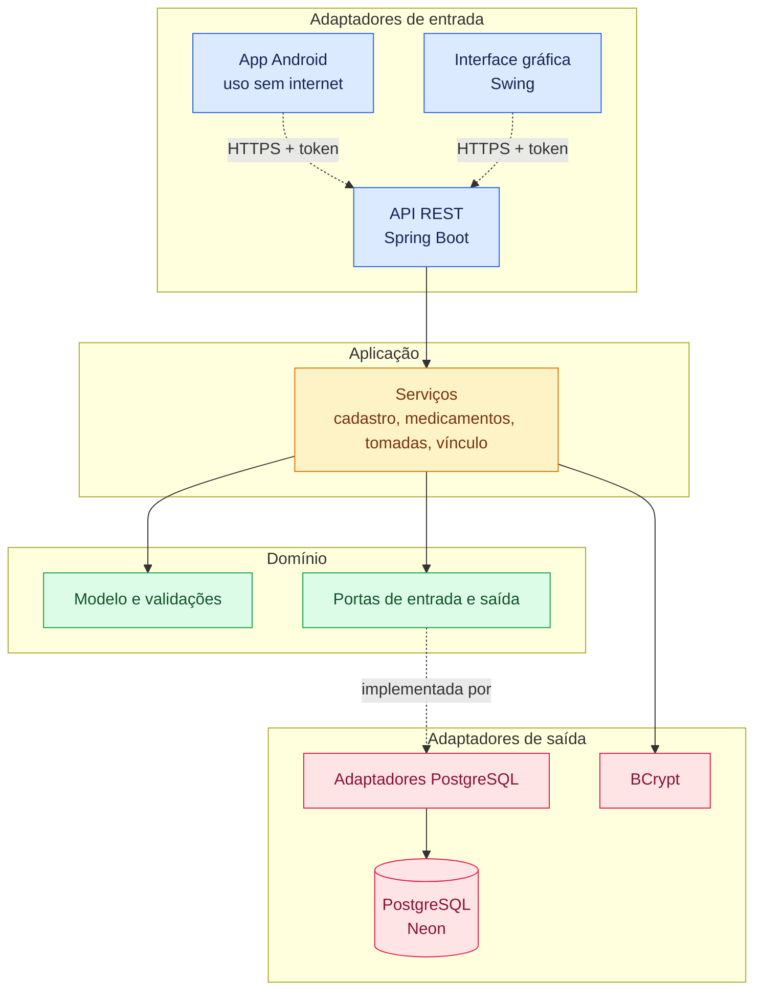

# CuidaMed — Acompanhamento de Medicamentos

Sistema para ajudar **idosos** e seus **familiares** a não esquecerem de tomar os medicamentos na hora certa.

A ideia é simples: cada idoso tem um ou mais familiares vinculados, cada medicamento tem um horário e um dia da semana marcados, e o sistema mostra — pro idoso, o que precisa tomar e quando, e pro familiar, se o remédio foi ou não tomado. Cada pessoa entra com seu próprio usuário e só vê o que é relevante pra ela. O idoso decide quem o acompanha: o familiar pede o vínculo e o idoso precisa aceitar.

Os dados ficam num **banco PostgreSQL online** (Neon), e existe uma **API REST no ar** (Render) que vai servir o app Android, ainda em desenvolvimento. Também é possível usar o sistema no computador, por uma **interface gráfica** feita para idosos, que fala com a mesma API.

## Índice

- [Como está o projeto](#como-está-o-projeto)
- [Funcionalidades](#funcionalidades)
- [API REST](#api-rest)
- [Como rodar](#como-rodar)
- [Deploy](#deploy)
- [Tecnologias](#tecnologias)
- [Arquitetura](#arquitetura)
- [Decisões de arquitetura (ADRs)](#decisões-de-arquitetura-adrs)
- [Próximos passos](#próximos-passos)
- [Licença](#licença)

## Como está o projeto

```
 [App Android]  ──HTTPS──▶  [API REST]  ──▶  [PostgreSQL / Neon]
  (em teste)                (Render)
 [Interface gráfica]  ──HTTPS──▶  [API REST]
   (no computador)               (a mesma do app)
```

| Parte | Situação |
|---|---|
| Regras de negócio (idoso, familiar, medicamentos, tomadas, vínculo) | Pronto |
| Banco PostgreSQL (Neon) | Pronto |
| API REST, com login por token | No ar (Render) |
| Interface gráfica (Swing) | Pronta; fala com a API (não acessa o banco) |
| App Android (Kotlin), inclusive **sem internet** | Em teste no celular (pasta `app-android/`) |
| Lembretes e avisos por notificação no celular | Prontos (o aviso ao familiar pode levar alguns minutos) |
| Push instantâneo (Firebase), inclusive o aviso de remédio esquecido | Pronto |

## Funcionalidades

### Por tipo de usuário

| | Idoso | Familiar |
|---|---|---|
| Cadastro e login (e-mail e senha) | ✅ | ✅ |
| Editar os próprios dados | ✅ | ✅ |
| Excluir a própria conta (só pela API, por enquanto) | ✅ | ✅ |
| Cadastrar, editar e excluir medicamentos | Os seus | Os de cada idoso que acompanha |
| Marcar um remédio como tomado | ✅ | — |
| Ver o histórico de tomadas | O seu | O de cada idoso que acompanha |
| Ver avisos (lembrete, tomado, atrasado) | ✅ | ✅ |
| Pedir para acompanhar um idoso | — | ✅ |
| Aceitar ou recusar pedidos, e remover um familiar | ✅ | — |
| Adicionar um familiar direto (já nasce aceito) | ✅ | — |

### Vínculo entre idoso e familiar

O familiar **pede** para acompanhar um idoso, pelo e-mail dele. O pedido fica **pendente** e vale **24 horas**. Só depois de o idoso **aceitar** o familiar passa a ver os medicamentos, o histórico e os avisos dele. O idoso pode **recusar** ou **remover** um familiar a qualquer momento.

### Interface gráfica (Swing)

Feita para quem tem dificuldade com telas pequenas e formulários:
- **Letra ajustável** (botões `A−` e `A+`) e **modo claro/escuro**, lembrados na próxima abertura
- Poucas opções por tela, botões grandes e textos diretos
- Tipo do remédio, dia da semana e horário são escolhidos por botões, **sem digitar formatos**
- Estados nunca dependem só de cor: "Tomou" e "Não tomou" aparecem escritos
- Confirmações grandes; na exclusão, o botão padrão é o "Não, manter"

### Regras de negócio

- `Usuario` como base, com `Idoso` e `Familiar` estendendo essa classe
- Medicamento com dono (`idosoId`), validado no cadastro: só é aceito se o id pertencer a um idoso de verdade
- Histórico de tomadas, guardando se cada remédio foi tomado e quando; o idoso só registra uma tomada por remédio por dia
- Cadastro e edição validados (nome, e-mail, e-mail duplicado, dados obrigatórios); a edição é **parcial**: só os campos informados mudam
- Senha protegida com **hash BCrypt**, nunca guardada em texto puro, e mensagem de login genérica (não revela se o e-mail existe)
- Verificação de atraso, com tolerância de 10 minutos, considerando o dia da semana e se o remédio já foi confirmado no dia. Os avisos aparecem ao abrir a tela inicial; o `AgendadorVerificacaoAtraso` (execução automática a cada minuto) já existe, mas **ainda não é iniciado** por nenhuma interface

### Privacidade (LGPD)

Medicamentos são dados de saúde, então a exclusão de conta é de verdade: ao excluir, os **medicamentos, o histórico e os vínculos** da pessoa são apagados e o cadastro fica **anonimizado** (nome, e-mail e senha), sobrando só um registro anônimo. Excluir um medicamento também apaga o nome dele. O que ainda falta (consentimento na tela de cadastro, política de privacidade e exportação dos dados) está nos [próximos passos](#próximos-passos).

## API REST

No ar em `https://sistema-de-acompanhamento-de-medicamentos.onrender.com/api/v1` (o plano gratuito hiberna quando fica parado; a primeira requisição depois de um tempo pode levar de 30 a 60 segundos).

**Login:** `POST /auth/login` devolve um **token de acesso** (JWT, vale 15 minutos) e um **token de renovação** (vale 30 dias, trocado a cada uso). Nas demais rotas, envie `Authorization: Bearer <token de acesso>`. Se o token de renovação for reutilizado, todas as sessões da pessoa são encerradas.

**Segurança:**
- **Senha:** de 8 a 72 caracteres.
- **Limites (HTTP 429):** cinco senhas erradas para o mesmo e-mail e IP bloqueiam o login por 15 minutos; há também um limite por IP, um limite de 10 contas novas por hora por IP e um limite de tentativas de confirmar a senha atual.
- **Ações perigosas pedem a senha atual:** trocar a senha ou o e-mail (`senhaAtual` no `PATCH /me`) e excluir a conta (`senha` no corpo do `DELETE /me`). Quem só roubou um token de acesso não consegue fazer isso.
- **Vínculos:** os pedidos por e-mail respondem sempre igual (HTTP 202), exista a conta ou não, para não revelar quem usa o sistema.

| Grupo | Rotas |
|---|---|
| Autenticação | `POST /auth/registro`, `/auth/login`, `/auth/renovar`, `/auth/sair` |
| Conta | `GET`, `PATCH` (trocar senha ou e-mail exige `senhaAtual`) e `DELETE` (exige `senha` no corpo) em `/me`; `GET /me/idosos`; `GET /me/familiares` |
| Medicamentos | `GET` e `POST /idosos/{id}/medicamentos`; `PATCH` e `DELETE /medicamentos/{id}` |
| Tomadas e avisos | `POST /medicamentos/{id}/tomadas` (aceita `{"dataHora": ...}` com a hora real da tomada); `GET /idosos/{id}/historico`; `GET /idosos/{id}/notificacoes` |
| Vínculos | `POST` e `GET /vinculos/pedidos`; `POST /vinculos/pedidos/{familiarId}/aceitar` ou `/recusar`; `POST /me/familiares`; `DELETE /me/familiares/{familiarId}` |
| Saúde | `GET /saude` (pública, para saber se a API está no ar) |

Exemplo:

```bash
curl -s -X POST https://sistema-de-acompanhamento-de-medicamentos.onrender.com/api/v1/auth/login \
  -H "Content-Type: application/json" \
  -d '{"email":"voce@exemplo.com","senha":"sua-senha"}'
```

Os erros voltam como `{"erro": "mensagem"}`. Idoso só acessa os próprios dados, e familiar só os dos idosos que aceitaram o vínculo.

## Como rodar

### Pré-requisitos

- Java 17+
- Maven
- Uma conta gratuita na [Neon](https://neon.tech) (o banco PostgreSQL)

### 1. Configurar o banco

1. Crie um projeto na Neon e, no **SQL Editor**, execute, nesta ordem, os arquivos de `Gerenciador de Medicamentos/src/main/resources/db/migration/`:
   - `V1__criar_tabelas.sql`
   - `V2__criar_refresh_token.sql` (necessário para a API)
   - `V3__uma_tomada_por_remedio_por_dia.sql` (impede duas tomadas do mesmo remédio no mesmo dia)
   - `V4__criar_chave_idempotencia.sql` (necessário para o uso sem internet do app: evita remédio duplicado ao reenviar)
   - `V5__criar_dispositivo.sql` (necessário para o push instantâneo: guarda o token do Firebase de cada aparelho)
   - `V6__criar_aviso_atraso_enviado.sql` (necessário para o aviso de "remédio esquecido" na hora: evita repetir o mesmo aviso)
   - `V7__criar_consentimento.sql` (necessário para a LGPD: guarda qual versão da política cada pessoa aceitou e quando)
   - `V8__criar_metrica_anuncio.sql` (contagens anônimas dos banners, para o painel de anúncios)
   - `V9__criar_banner.sql` (os banners de anúncio, com a imagem; cadastrados pelo painel)
   - `V10__adicionar_video_ao_banner.sql` (vídeo curto opcional no banner)
   - `V11__medicamento_vigente_desde.sql` (desde quando o horário do remédio vale, para o "não tomou" do histórico)
2. Copie `.env.example` para `.env` na raiz do repositório e preencha:
   - `DATABASE_URL`: a string de conexão da Neon (botão **Connect**)
   - `JWT_SECRET`: só para a API; um texto aleatório com pelo menos 32 caracteres (`openssl rand -base64 48`)

O `.env` está no `.gitignore` e **nunca deve ir para o Git**. Também dá para usar variáveis de ambiente de mesmo nome. A API não sobe sem `DATABASE_URL`. A interface gráfica **não precisa** dela: só fala com a API (por padrão, a do Render; para usar outra, defina `CUIDAMED_API_URL`, por exemplo `http://localhost:8080/api/v1`).

### 2. Iniciar

Rode sempre a partir da **raiz do repositório**.

**Interface gráfica (recomendada):**

```bash
mvn -f "Gerenciador de Medicamentos/pom.xml" compile exec:java -Dexec.mainClass="br.com.adapter.in.gui.GuiApp"
```

**API (local, porta 8080):**

```bash
mvn -f "Gerenciador de Medicamentos/pom.xml" compile exec:java -Dexec.mainClass="br.com.adapter.in.web.ApiApp"
# depois abra http://localhost:8080/api/v1/saude
```

No IntelliJ, dá para iniciar pelo ▶ ao lado do `main` de `GuiApp` ou `ApiApp`.

### 3. Testes

```bash
mvn -f "Gerenciador de Medicamentos/pom.xml" test
```

São 33 testes: integração da API (com adaptadores em memória no lugar do banco), limites de tentativas, regras de senha e e-mail, e os avisos de horário (inclusive a virada da meia-noite). Eles **não** cobrem o SQL dos adaptadores PostgreSQL, que foi verificado à parte, num esquema temporário do banco.

## App Android

Está na pasta [`app-android/`](app-android/) (Kotlin e Jetpack Compose, Android 8.0 ou mais novo). Tem as mesmas telas da interface do computador, com letra grande e ajustável, modo claro e escuro e botões grandes.

**Funciona sem internet:** você vê o que já foi carregado e pode marcar "Já tomei" e cadastrar, editar ou excluir remédios. As alterações entram numa fila no aparelho e sobem sozinhas, na ordem, quando a internet volta. Se algo for recusado pelo servidor (por exemplo, o remédio foi excluído por outra pessoa), o app avisa o que não foi aplicado. Os dados guardados no aparelho ficam criptografados, e sair da conta os apaga. Detalhes no [ADR-0049](Gerenciador%20de%20Medicamentos/docs/adr/ADR0049-uso-sem-internet-no-app-android.md).

**Notificações:** lembrete no horário de cada remédio (alarme do próprio aparelho, funciona sem internet) e avisos ao familiar e ao idoso (conferidos em segundo plano).

**Compilar e instalar** (precisa do Android Studio instalado, que traz o SDK e o JDK):

```bash
cd app-android
JAVA_HOME=<pasta do JDK do Android Studio> ANDROID_HOME=~/Android/Sdk ./gradlew assembleDebug
~/Android/Sdk/platform-tools/adb install -r app/build/outputs/apk/debug/app-debug.apk
```

Testes do app: `./gradlew testDebugUnitTest`.

## Deploy

A API roda no **Render** (plano gratuito), num contêiner Docker:

- `Dockerfile` (na raiz): compila com Maven e roda o `.jar` com Java 17, com a memória da JVM limitada para caber nos 512 MB do plano
- `render.yaml`: descreve o serviço e a verificação de saúde (`/api/v1/saude`)
- No painel do Render, configure `DATABASE_URL` e `JWT_SECRET` (use um segredo diferente do local). Esses valores não ficam no Git.

## Tecnologias

- Java 17 e Maven
- Spring Boot 3.5 (API REST) e JWT (jjwt)
- PostgreSQL (Neon), JDBC e HikariCP
- Swing (interface gráfica, sem dependências extras)
- jBCrypt (hash de senha) e Caelum Stella (validações)
- JUnit 5 e MockMvc (testes)
- Docker e Render (deploy)

## Arquitetura

O projeto segue o padrão **Ports & Adapters (Hexagonal)**: a regra de negócio fica isolada no centro, sem depender de banco de dados, frameworks ou forma de entrada e saída. Tudo que é externo se conecta por contratos (**portas**) e implementações trocáveis (**adaptadores**). Foi isso que permitiu trocar o CSV pelo PostgreSQL, acrescentar a API e depois tirar o terminal e o CSV sem mexer nas regras. Mais detalhes em [`arquitetura-utilizada.md`](Gerenciador%20de%20Medicamentos/docs/arquitetura/arquitetura-utilizada.md).

```
.
├── Dockerfile  render.yaml          (deploy da API)
├── .env.example                     (modelo da configuração; o .env real fica fora do Git)
└── Gerenciador de Medicamentos/
    ├── docs/adr/                    (decisões de arquitetura)
    ├── pom.xml
    └── src/
        ├── main/java/br/com/
        │   ├── domain/
        │   │   ├── model/           (Usuario, Idoso, Familiar, Medicamento, PedidoVinculo...)
        │   │   ├── port/in/  out/   (contratos)
        │   │   ├── validation/  exception/  util/
        │   ├── application/service/ (lógica de negócio)
        │   ├── adapter/
        │   │   ├── in/              gui/  web/
        │   │   └── out/             persistence/postgres  id/  security/
        │   └── config/              (montagem das peças e leitura da configuração)
        ├── main/resources/db/migration/   (scripts SQL do banco)
        └── test/                    (testes da API)
```

| Pasta | Responsabilidade |
|---|---|
| `domain/model` | Classes puras do negócio, sem anotação de banco nem framework |
| `domain/port/in` | O que o sistema sabe fazer (cadastrar, editar, registrar tomada, login, vínculo...), seja quem for que chame |
| `domain/port/out` | O que o sistema precisa que alguém faça por ele (salvar, buscar, gerar id, criptografar...), sem dizer como |
| `application/service` | Implementação das portas de entrada, onde a lógica acontece |
| `adapter/in/web` | API REST: autenticação por token, regras de acesso, controladores e tratamento de erros |
| `adapter/in/gui` | Interface gráfica Swing (`GuiApp` é o ponto de entrada). É só um **cliente da API** (`gui/api/ClienteApi`): não importa serviços, portas nem banco (um teste garante isso) |
| `adapter/out/persistence/postgres` | Adaptadores do banco PostgreSQL |
| `config` | `Ambiente` lê variáveis de ambiente e o `.env` |

**Regra de ouro:** as dependências sempre apontam para dentro. O `domain/` não conhece ninguém; o `application/` conhece só o `domain/`; os `adapter/` conhecem o `domain/`, mas o `domain/` nunca conhece os adapters.

### Diagrama



## Decisões de arquitetura (ADRs)

O que foi decidido, as alternativas consideradas e o porquê estão documentados na pasta [`docs/adr/`](Gerenciador%20de%20Medicamentos/docs/adr/). Alguns exemplos:

- [ADR-0001](Gerenciador%20de%20Medicamentos/docs/adr/ADR0001-arquitetura.md): arquitetura hexagonal
- [ADR-0028](Gerenciador%20de%20Medicamentos/docs/adr/ADR0028-criptografia-senha.md): criptografia de senha
- [ADR-0044](Gerenciador%20de%20Medicamentos/docs/adr/ADR0044-interface-grafica-swing.md): interface gráfica em Swing, pensada para idosos
- [ADR-0046](Gerenciador%20de%20Medicamentos/docs/adr/ADR0046-persistencia-postgresql-e-aceite-de-vinculo.md): persistência em PostgreSQL e aceite do vínculo pelo idoso
- [ADR-0047](Gerenciador%20de%20Medicamentos/docs/adr/ADR0047-api-rest-e-deploy-no-render.md): API REST, login por token e deploy no Render
- [ADR-0048](Gerenciador%20de%20Medicamentos/docs/adr/ADR0048-correcoes-da-revisao-do-projeto.md): correções da revisão do projeto (segurança, robustez e avisos de horário)
- [ADR-0049](Gerenciador%20de%20Medicamentos/docs/adr/ADR0049-uso-sem-internet-no-app-android.md): uso sem internet no app Android (cópia local, fila de alterações e sincronização)
- [ADR-0050](Gerenciador%20de%20Medicamentos/docs/adr/ADR0050-push-instantaneo-com-firebase.md): push instantâneo com o Firebase (FCM)
- [ADR-0051](Gerenciador%20de%20Medicamentos/docs/adr/ADR0051-aviso-de-remedio-esquecido-por-agendador-externo.md): aviso de "remédio esquecido" na hora, com agendador externo
- [ADR-0052](Gerenciador%20de%20Medicamentos/docs/adr/ADR0052-lgpd-consentimento-politica-e-exportacao-de-dados.md): LGPD (consentimento, política de privacidade e exportação dos dados)
- [ADR-0053](Gerenciador%20de%20Medicamentos/docs/adr/ADR0053-remocao-do-terminal-e-do-csv-gui-como-cliente-da-api.md): remoção do terminal e do CSV; a interface gráfica passa a usar a API
- [ADR-0054](Gerenciador%20de%20Medicamentos/docs/adr/ADR0054-banners-de-anuncios-no-app-android.md): banners de anúncios no app Android
- [ADR-0055](Gerenciador%20de%20Medicamentos/docs/adr/ADR0055-metricas-e-painel-de-anuncios.md): métricas dos banners e painel de anúncios
- [ADR-0056](Gerenciador%20de%20Medicamentos/docs/adr/ADR0056-rodizio-justo-dos-banners.md): rodízio justo dos banners (exibições parecidas para todos)
- [ADR-0057](Gerenciador%20de%20Medicamentos/docs/adr/ADR0057-banners-no-banco-e-cadastro-pelo-painel.md): banners no banco de dados e cadastro pelo painel
- [ADR-0058](Gerenciador%20de%20Medicamentos/docs/adr/ADR0058-video-curto-nos-banners.md): vídeo curto nos banners
- [ADR-0059](Gerenciador%20de%20Medicamentos/docs/adr/ADR0059-remedio-em-varios-dias-da-semana.md): remédio em vários dias da semana
- [ADR-0060](Gerenciador%20de%20Medicamentos/docs/adr/ADR0060-nao-tomou-no-historico.md): "não tomou" no histórico
- [ADR-0061](Gerenciador%20de%20Medicamentos/docs/adr/ADR0061-historico-em-pdf.md): histórico em PDF para levar ao médico
- [ADR-0062](Gerenciador%20de%20Medicamentos/docs/adr/ADR0062-alarme-no-lugar-da-notificacao.md): alarme de remédio no lugar da notificação

## Próximos passos

1. **Ícone próprio** do app e **APK assinado** para distribuição e, depois, a Play Store.
2. Cobrir os adaptadores PostgreSQL com testes automatizados (hoje são verificados à mão) e limpar tokens de renovação expirados.
3. Vínculos (pedir, aceitar, remover familiar), login e perfil ainda precisam de internet no app; avaliar se vale trazê-los para o modo sem internet.
4. Separar a interface gráfica do servidor em módulos Maven distintos (hoje ela é só um cliente da API, mas vai no mesmo projeto).

## Licença

O repositório ainda não tem um arquivo de licença.
