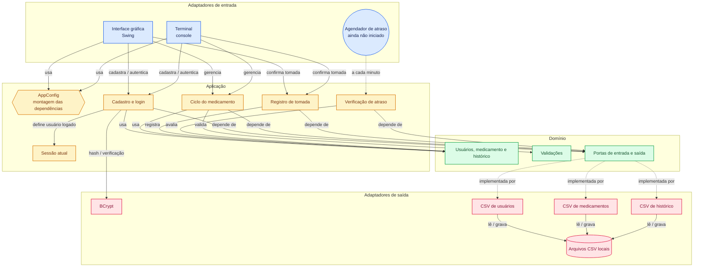

# CuidaMed — Acompanhamento de Medicamentos

Sistema para ajudar **idosos** e seus **familiares** a não esquecerem de tomar os medicamentos na hora certa.

A ideia é simples: cada idoso tem um ou mais familiares vinculados, cada medicamento tem um horário e um dia da semana marcados, e o sistema mostra — pro idoso, o que precisa tomar e quando, e pro familiar, se o remédio foi ou não tomado. Cada pessoa entra com seu próprio usuário e só vê o que é relevante pra ela.

Hoje o projeto roda no computador, com **interface gráfica** (pensada para idosos) e **terminal**, e guarda os dados em arquivos CSV. O próximo passo é levá-lo para um **app Android** com banco de dados online (ver [Próximos passos](#próximos-passos)).

## Índice

- [Funcionalidades](#funcionalidades)
- [Como rodar](#como-rodar)
- [Tecnologias](#tecnologias)
- [Arquitetura](#arquitetura)
- [Decisões de arquitetura (ADRs)](#decisões-de-arquitetura-adrs)
- [Próximos passos](#próximos-passos)
- [Licença](#licença)

## Funcionalidades

### Por tipo de usuário

| | Idoso | Familiar |
|---|---|---|
| Cadastro e login (e-mail e senha) | ✅ | ✅ |
| Editar os próprios dados | ✅ | ✅ |
| Cadastrar, editar e excluir medicamentos | Os seus | Os de qualquer idoso que acompanha |
| Marcar um remédio como tomado | ✅ | — |
| Ver o histórico de tomadas | O seu | O de cada idoso que acompanha |
| Ver notificações (lembrete, tomado, atrasado) | ✅ | ✅ |
| Ver a lista de idosos acompanhados | — | ✅ |
| Vincular-se a um familiar / idoso (hoje sem aceite; ver [Próximos passos](#próximos-passos)) | ✅ | ✅ |

### Interface gráfica (Swing)

Feita para quem tem dificuldade com telas pequenas e formulários:
- **Letra ajustável** (botões `A−` e `A+`) e **modo claro/escuro**, lembrados na próxima abertura
- Poucas opções por tela, botões grandes e textos diretos
- Tipo do remédio, dia da semana e horário são escolhidos por botões, **sem digitar formatos**
- Estados nunca dependem só de cor: "Tomou" e "Não tomou" aparecem escritos
- Confirmações grandes; na exclusão, o botão padrão é o "Não, manter"

### Terminal

Aplicação completa por menus numerados, com as mesmas regras de negócio da interface gráfica.

### Regras de negócio

- `Usuario` como base, com `Idoso` e `Familiar` estendendo essa classe
- Vínculo N:N entre idoso e familiar
- Medicamento com dono (`idosoId`), validado no cadastro: só é aceito se o id pertencer a um idoso de verdade
- Histórico de tomadas, guardando se cada remédio foi tomado e quando
- Cadastro e edição validados (nome, e-mail, e-mail duplicado, dados obrigatórios); a edição é **parcial**: só os campos informados mudam
- Senha protegida com **hash BCrypt**, nunca guardada em texto puro, e mensagem de login genérica (não revela se o e-mail existe)
- Ids sequenciais, continuando de onde pararam entre execuções
- Verificação de atraso, com tolerância de 10 minutos, considerando o dia da semana e se o remédio já foi confirmado no dia. Os avisos aparecem ao abrir a tela inicial; o `AgendadorVerificacaoAtraso` (execução automática a cada minuto) já existe, mas **ainda não é iniciado** pela interface gráfica nem pelo terminal
- Persistência em CSV (pasta `arquivos/`): usuários, vínculos, medicamentos e histórico sobrevivem entre execuções, com criar, listar, buscar, editar e excluir

## Como rodar

### Pré-requisitos

- Java 17+
- Maven

### Interface gráfica (recomendada)

```bash
# na raiz do repositório (onde fica a pasta arquivos/)
mvn -f "Gerenciador de Medicamentos/pom.xml" compile exec:java -Dexec.mainClass="br.com.adapter.in.gui.GuiApp"
```

### Terminal

```bash
# na raiz do repositório (onde fica a pasta arquivos/)
mvn -f "Gerenciador de Medicamentos/pom.xml" compile exec:java -Dexec.mainClass="br.com.adapter.in.console.TerminalApp"
```

> **Importante:** execute sempre a partir da raiz do repositório. Os dados (`arquivos/`) são lidos por caminho relativo; rodando de outra pasta o login não encontra os usuários.

Nos dois casos, a tela inicial permite fazer login ou se cadastrar (como idoso ou familiar) e, depois de logado, mostra as opções de acordo com o tipo de usuário. Os dados ficam em `arquivos/` e continuam disponíveis na próxima execução.

## Tecnologias

- Java 17 e Maven
- Swing (interface gráfica, sem dependências extras)
- jBCrypt (hash de senha)
- Caelum Stella (validações)
- Persistência em arquivos CSV

## Arquitetura

O projeto segue o padrão **Ports & Adapters (Hexagonal)**: a regra de negócio fica isolada no centro, sem depender de banco de dados, frameworks ou forma de entrada e saída. Tudo que é externo se conecta por contratos (**portas**) e implementações trocáveis (**adaptadores**). É isso que permite trocar o CSV por um banco online, ou acrescentar uma API, sem mexer nas regras. Mais detalhes em [`arquitetura-utilizada.md`](Gerenciador%20de%20Medicamentos/docs/arquitetura/arquitetura-utilizada.md).

```
.
├── arquivos/                        (dados em CSV)
└── Gerenciador de Medicamentos/
    ├── docs/
    │   ├── adr/                     (decisões de arquitetura)
    │   └── arquitetura/
    ├── pom.xml
    └── src/main/java/br/com/
        ├── domain/
        │   ├── model/               (Usuario, Idoso, Familiar, Medicamento...)
        │   ├── port/in/  port/out/  (contratos)
        │   ├── validation/
        │   ├── exception/
        │   └── util/
        ├── application/service/     (lógica de negócio)
        ├── adapter/
        │   ├── in/                  console/  gui/  scheduler/
        │   └── out/                 id/  notification/  persistence/  security/
        └── config/                  (montagem das peças)
```

| Pasta | Responsabilidade |
|---|---|
| `domain/model` | Classes puras do negócio, sem anotação de banco nem framework |
| `domain/port/in` | O que o sistema sabe fazer (cadastrar, editar, registrar tomada, login...), seja quem for que chame |
| `domain/port/out` | O que o sistema precisa que alguém faça por ele (salvar, buscar, gerar id, criptografar...), sem dizer como |
| `domain/validation`, `exception`, `util` | Validações, exceções de domínio e utilitários independentes de tecnologia |
| `application/service` | Implementação das portas de entrada, onde a lógica acontece |
| `adapter/in/gui` | Interface gráfica Swing (`GuiApp` é o ponto de entrada) |
| `adapter/in/console` | Aplicação de terminal (`TerminalApp` é o ponto de entrada) |
| `adapter/in/scheduler` | Verificação periódica de atraso |
| `adapter/out/persistence` | Leitura e escrita dos quatro arquivos CSV |
| `adapter/out/id` | Geração de id a partir do maior valor já persistido |
| `adapter/out/security` | Hash de senha com BCrypt |
| `adapter/out/notification` | Infraestrutura de notificação (hoje sem uso ativo: as notificações são consultadas sob demanda) |
| `config` | Escolhe qual adaptador concreto atende cada porta |

**Regra de ouro:** as dependências sempre apontam para dentro. O `domain/` não conhece ninguém; o `application/` conhece só o `domain/`; os `adapter/` conhecem o `domain/`, mas o `domain/` nunca conhece os adapters.

### Diagrama



## Decisões de arquitetura (ADRs)

O que foi decidido, as alternativas consideradas e o porquê estão documentados na pasta [`docs/adr/`](Gerenciador%20de%20Medicamentos/docs/adr/). Alguns exemplos:

- [ADR-0001](Gerenciador%20de%20Medicamentos/docs/adr/ADR0001-arquitetura.md): arquitetura hexagonal
- [ADR-0028](Gerenciador%20de%20Medicamentos/docs/adr/ADR0028-criptografia-senha.md): criptografia de senha
- [ADR-0044](Gerenciador%20de%20Medicamentos/docs/adr/ADR0044-interface-grafica-swing.md): interface gráfica em Swing, pensada para idosos
- [ADR-0045](Gerenciador%20de%20Medicamentos/docs/adr/ADR0045-planejamento-postgres-online-e-app-android.md): planejamento dos próximos passos (rascunho)

## Próximos passos

O plano completo está no [ADR-0045](Gerenciador%20de%20Medicamentos/docs/adr/ADR0045-planejamento-postgres-online-e-app-android.md). Em resumo:

1. **Banco PostgreSQL online** (gratuito, no Neon), com um adaptador de persistência que implementa as mesmas portas atuais, e migração dos dados dos CSV.
2. **API REST** (Java/Spring Boot, hospedada no Render), com login por token (JWT de vida curta e token de renovação) e as mesmas regras de acesso de hoje.
3. **App Android em Kotlin**, com uso offline: alterações ficam guardadas no aparelho e são sincronizadas quando houver internet. Conflitos são resolvidos por peso (excluir vence editar, que vence criar; em empate, vale o mais recente).
4. **Notificações no celular**: lembrete de horário por alarme local (funciona offline) e aviso ao familiar por push via Firebase Cloud Messaging.
5. **Vínculo com aceite do idoso**: o familiar solicita, o idoso aceita (o pedido expira em 24 horas) e pode remover o familiar depois.
6. **Distribuição por APK** assinado, e depois pela Play Store.
7. **LGPD**: consentimento, exclusão de conta e exportação dos dados, já que medicamentos são dados de saúde.
8. **Testes automatizados** (ainda não existe nenhum).

A interface gráfica e o terminal continuam existindo.

## Licença

Este projeto está sob a licença presente no arquivo [LICENSE](LICENSE).
